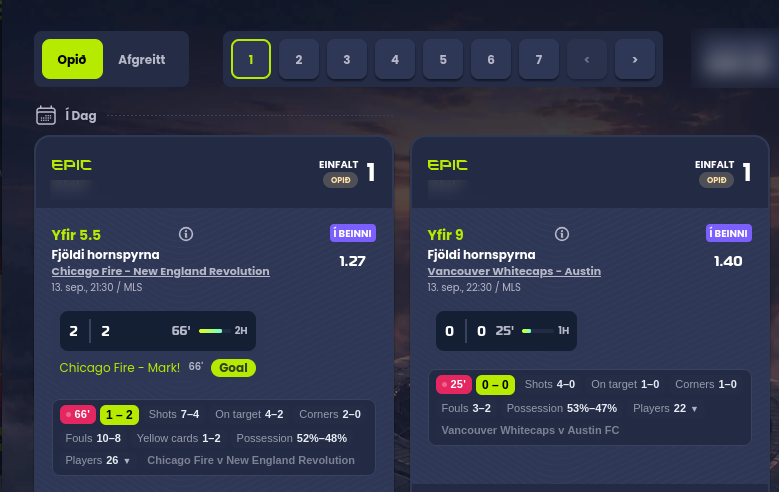

# SagaBet Live Stats

Live match statistics on your **epicbet** bet slip — shots, corners, cards, possession, and
a full per-player breakdown — right under each selection.



> Not affiliated with epicbet, SofaScore or FotMob. An independent, open-source tool that
> runs in your own browser. Free, no account, no ads, no tracking.

---

## What it adds

Under every bet on a match that's currently being played, you get a strip like this:

```
● 66' │ 1–2 │ Shots 7–4 │ On target 4–2 │ Corners 2–0 │ Fouls 10–8 │ Cards 1–2 │ Possession 52%–48% │ Players 26 ▼
```

- If your bet is a **totals** bet ("over 5.5 corners", "match total shots"), the first chip
  shows the running count against your line — `Corners 3 / 5.5`.
- **Players ▼** opens a table of every player on the pitch: shots, shots on target, fouls,
  rating, and a 🟨/🟥 next to anyone booked.
- epicbet's own **Í beinni** badge gets a **✓** when stats are available for that match, or
  a **✕** when the provider doesn't have it.
- 22 team stats and 17 player stats are available; you choose which ones show.

It only does anything on matches that are actually in play.

---

## Install

Pick your browser. **You do not need to be a programmer** — there's a ready-made file to
download for Firefox and Chrome.

> **Why isn't this in the Chrome/Firefox store?** Store listings for gambling-related
> extensions are a slow and uncertain process. Installing from a file works exactly the
> same, it just takes two extra clicks.

### 🦊 Firefox, Zen, LibreWolf or Waterfox

**1.** Download **`sagabet-livestats-firefox-mv2.xpi`** from the
[latest release](../../releases/latest).

**2.** Allow your browser to install add-ons that aren't from Mozilla's store:

   - Type `about:config` in the address bar and press Enter
   - Click **Accept the Risk and Continue**
   - In the search box at the top, paste: `xpinstall.signatures.required`
   - Double-click the row that appears so the value changes from `true` to **`false`**

   *(This works in Zen, LibreWolf and Waterfox. Standard Firefox blocks it — see
   [Firefox users](#standard-firefox) below.)*

**3.** Install it:

   - Type `about:addons` in the address bar and press Enter
   - Click the **gear icon** ⚙ near the top right
   - Choose **Install Add-on From File…**
   - Pick the `.xpi` file you downloaded
   - Click **Add** when asked

**4.** Go to epicbet, open **My bets**, and look at a bet on a match being played right now.

#### Standard Firefox

Regular Firefox refuses unsigned add-ons and has no override. Use
`about:debugging#/runtime/this-firefox` → **Load Temporary Add-on…** → pick the `.xpi`. It
works immediately but is removed when you close Firefox, so it's fine for trying out and
annoying for daily use. Zen doesn't have this limitation.

### 🌐 Chrome, Edge, Brave or Opera

**1.** Download **`sagabet-livestats-chrome.zip`** from the
[latest release](../../releases/latest).

**2.** **Unzip it.** Right-click the file → *Extract All* (Windows) or double-click it
(Mac). You'll get a folder called `sagabet-livestats-chrome`. **Keep this folder** — don't
delete it after installing, Chrome loads the extension from it every time it starts. Put it
somewhere permanent like your Documents folder.

**3.** Type `chrome://extensions` in the address bar and press Enter.

**4.** Turn on **Developer mode** — the switch in the **top-right corner**.

**5.** Click **Load unpacked** — the button that appears in the top-left.

**6.** Select the **folder** you unzipped. Select the folder itself; don't go inside it and
pick a file.

**7.** Go to epicbet, open **My bets**, and look at a bet on a match being played now.

Chrome will show a "Disable developer mode extensions" warning each time it starts. That's
normal for any extension installed from a file; you can dismiss it.

### 🧭 Safari

**Safari is genuinely difficult and needs a Mac with Xcode installed** — Apple requires
every Safari extension to be wrapped in an app. There's no download-and-click option. If
you're comfortable with a terminal:

```bash
git clone https://github.com/<your-username>/sagabet-livestats.git
cd sagabet-livestats
npm run build:safari
xcrun safari-web-extension-converter dist/safari --project-location safari/ --macos-only
open "safari/SagaBet Live Stats/SagaBet Live Stats.xcodeproj"
```

Build and run it in Xcode. Then in Safari: **Settings → Advanced →** tick *Show features for
web developers*, **Settings → Developer →** tick *Allow unsigned extensions*, and finally
**Settings → Extensions →** enable it and allow access to epicbet.

---

## Is this safe to install?

Fair question — you're installing something that can read a page with your bets on it.

- **All the code is here.** Nothing is minified or obfuscated; it's a few hundred lines of
  plain JavaScript you or anyone can read.
- **It sends nothing about you anywhere.** No analytics, no tracking, no server, no account.
  Your settings live in your own browser.
- **What it actually does:** reads the team names in your bet slip, asks a public football
  stats service for that match, and draws the numbers on the page.
- **The permissions it asks for:** access to `epicbet.com` (to read the bet slip and draw on
  it) and to the two stats providers (to look matches up). That's all of them.
- **It never places, changes or cancels bets**, and it can't — it only reads and displays.

---

## Troubleshooting

**Nothing appears under my bet.**
The match has to be *in play right now*. epicbet shows a running clock like `66'` on those.
Bets on matches that haven't kicked off, or have finished, get nothing.

**The badge shows ✕.**
The stats provider doesn't have that match in its live list — common for lower divisions and
youth leagues. The strip tells you the closest match it found. Try switching provider in the
settings (toolbar icon → *Data source*).

**I see nothing at all, ever.**
Check the extension is enabled in your browser's add-ons page, and that you're on
`epicbet.com` or `epicbet.io`. If it's still dead, open the settings and turn on *Log debug
output to the page console*, then press F12 on epicbet and look at the Console tab — and
[open an issue](../../issues) with what it says.

**Chrome says the extension may have been corrupted.**
You moved or deleted the unzipped folder. Chrome needs it to stay where it was when you
installed. Put it back, or reinstall from step 2.

---

## Settings

Nothing needs configuring — it works out of the box. Click the extension's icon in the
toolbar to change any of this:

| Setting | Default | Notes |
|---|---|---|
| Data source | SofaScore | Or FotMob, or API-Football with your own key. Unusable sources are skipped and the next one is tried |
| Refresh | 30s | No quota to protect, so this is purely how fresh you want it |
| Only look up matches epicbet shows as in play | on | Off looks up every football selection |
| Team stats | 6 of 22 | Chips shown under each bet |
| Player stats | 4 of 17 | Columns in the expandable table |
| Debug logging | off | Logs what the adapter found, to the page console |

Deeper troubleshooting and the developer setup live in **[SETUP.md](SETUP.md)**.

---

## How it works

| Piece | File | Role |
|---|---|---|
| DOM adapter | `src/content/extract.js` | Finds selections in the bets modal, scrapes the fixture |
| Renderer | `src/content/render.js` | Injects the strip into a shadow root under each row |
| Loop | `src/content/content.js` | Re-scans on DOM mutation, polls on an interval |
| Connectors | `src/background/sofascore.js`, `fotmob.js`, `api-football.js` | Live feeds — two keyless, one BYOK — with fallback |
| Vocabulary | `src/background/stat-keys.js` | Canonical keys both connectors translate into |
| Matcher | `src/background/matcher.js` | Fuzzy-matches bookmaker team names to a fixture |
| Broker | `src/background/service-worker.js` | Caching, dedupe, provider fallback |

### Reading the page

epicbet's class names are content-hashed (`_1yfzc7i3`, `_1axdwyn0`) and change on every
deploy, so the adapter keys off the site's `data-testid` / `data-match-id` attributes and
the structure around them. Three things make it hold up:

- **The fixture is located via the meta line, not by position.** Outright bets put a `" - "`
  in the *market* name ("Tímabil H2H Ashford Town - Westvale"), so naive parsing invents
  matches that don't exist. The adapter finds the `<time> / <league>` line — numeric, so
  language-independent — and takes the element before it.
- **Live is detected from the running clock**, not a label. epicbet renders the score widget
  for any started match but shows a clock only while it's in play. This is what keeps
  lookups to matches that can actually return something.
- **`data-sport-id` gates the lookup.** `1` is football; `18` is American football, which no
  football feed covers.

### Matching team names

Bookmakers and stats providers rarely spell clubs the same way — "Brest" vs "Stade Brestois
29", "Man Utd" vs "Manchester United", "Bayern Munich" vs "Bayern München". The matcher
normalises, strips club-name noise, applies an alias table, and falls back to character
bigram similarity, scoring both teams and both orientations. A league name breaks ties but
never gates a match, because epicbet localises competition names.

### Data sources

Three connectors, all translating into one canonical vocabulary so they're interchangeable.

| | SofaScore (default) | FotMob | API-Football |
|---|---|---|---|
| Key needed | no | no | **yes, your own** |
| Documented API | no | no | yes |
| Team stats | 22 canonical keys | 22 canonical keys | 15 canonical keys |
| Player stats | from `lineups` | from `playerStats` | from `fixtures/players` |
| Per-player shots | `totalShots` etc. | derived from `shotmap` — every shot with minute, xG, on-target flag | `shots.total` / `shots.on` |
| Cards per player | `incidents` feed | `matchFacts` events | per-player `cards` |
| Quota | none | none | 100 req/day on the free plan |

### Bring your own key

API-Football is a **licensed, documented API** — the option to reach for if you'd rather
not depend on undocumented endpoints, or if you're distributing this to anyone. Register
free at [dashboard.api-football.com](https://dashboard.api-football.com/register), then
paste the key into the extension's options; a key panel appears when you select that
source.

The key is stored in your browser's extension storage and sent only to API-Football. **It
is never in this repository or in any build** — and it cannot be. A browser extension ships
to every user as readable files, so there is no way to embed a secret in one. Bring-your-own-key
is the only honest arrangement; the alternative is running a proxy server that holds the key
and pays for everyone's usage.

> **SofaScore and FotMob are undocumented endpoints, not published APIs.** They can change or start
> refusing requests without notice. That is why there are two of them, why every field is
> read defensively, and why the normalizers are pinned by tests. Use of them is subject to
> those providers' terms, not this project's licence — if you intend to distribute or
> monetize anything built on this, get a licensed feed instead.

One call fetches the live-match list, shared by every bet, plus one detail call per distinct
match you hold a bet on. Responses are cached for the refresh interval and concurrent
requests are deduped. All network calls happen in the background worker, never in the page.

### Privacy

The extension stores your settings locally and sends nothing anywhere. It has no analytics,
no telemetry, no remote configuration, and no server. It reads the bets modal on epicbet and
calls the two stats providers; that is the whole of its network activity.

---

## Development

Build from source (Node.js required — there is no bundler and no runtime dependency):

```bash
git clone https://github.com/<your-username>/sagabet-livestats.git
cd sagabet-livestats
npm install          # only linkedom, used by the tests
npm run build        # -> dist/chrome, dist/firefox, dist/firefox-mv2, dist/safari
```

```bash
npm test              # matcher, DOM adapter, both connectors, full render pipeline
npm run check:live    # are the provider endpoints up right now?
npm run build         # all targets
```

| Script | Covers |
|---|---|
| `test-matcher.mjs` | Team-name matching, including a pair that must *not* match |
| `test-extract.mjs` | DOM adapter against `samples/fixtures/bets.html`, with assertions |
| `test-normalize.mjs` | All three connectors against API responses in `samples/api/` |
| `test-render.mjs` | Full pipeline: page fixture + real provider data → rendered strip |

`samples/fixtures/bets.html` is a synthetic stand-in for the bets modal. It reproduces the
real structure with invented data and deliberately includes the cases that break naive
parsing: a live match, a finished one, an unstarted one, an outright whose market name
contains `" - "`, and an American-football selection.

**Two caveats on the connector tests.** SofaScore and FotMob TLS-fingerprint their callers
and reject Node's `fetch` whatever headers you send — Chrome passes, which is where the
extension runs, so those two are tested against responses captured with curl, and
`npm run check:live` probes the real endpoints. The API-Football fixtures are *synthetic*,
written from its published v3 schema rather than captured, because that connector needs a
key nobody had at the time; a failure there is a hint, not proof.

### Icons

`src/icons/icon.svg` is the source. Regenerate the PNGs with `node scripts/make-icons.mjs`
(needs `rsvg-convert`).

### Adapting after an epicbet redesign

`src/content/extract.js` is the only site-specific file. Save a copy of the bets modal, run
`node scripts/test-extract.mjs <your-file.html>` to see what the adapter makes of it, and
use `scripts/slice.py <file> <needle>` to pretty-print any subtree of the saved page.

There is also a console probe for checking the adapter against the live site without
installing anything — see [SETUP.md](SETUP.md#the-scraping-probe).

---

## Licence

[MIT](LICENSE).

Nothing here is betting advice, and live data can be wrong, delayed, or missing. Check
anything that matters against the source.
